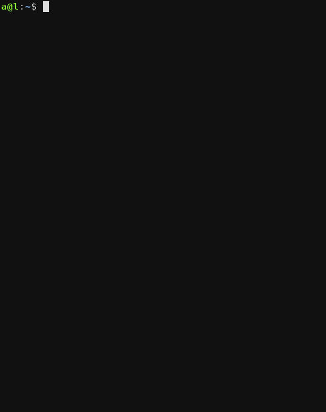

===================================
Ali - smart shell alias replacement
===================================

The biggest problem with the standard shell alias system is its best feature: simplicity.
In short, an alias is nothing else, just a substitution of a shell command prefix.
Ali tries to stay as simple as the built-in alias command, while providing way more functionality and flexibility.

Features
========

- Supports multiple and positional alias arguments
- Alias management
- Bash and Zsh compatibility

Install
=======

clone and source ``ali.sh``

Usage
=====

.. code:: bash

    $ ali [[ACTION] ACTION_ARGS..]

Actions
-------

define
~~~~~~

Define alias

Standard alias definition: ``ali define myls ls -l``

Multiple arguments and argument reorder: ``ali define lwc ls -l \$2 \| wc \$1``. Example usage:  ``lwc -l ../``

Pipes: ``ali define logthis \$@ \| tee -a mylog.log``. Example usage: ``logthis any_command --with --args``

register
~~~~~~~~

Save and define alias

Same as ``define`` except it persists defined aliases.
Sourcing ``ali.sh`` automatically loads saved aliases.

list
~~~~

List persisted aliases

expand
~~~~~~

Display the definition of a given alias

delete
~~~~~~

Delete given alias

load
~~~~

Load persisted aliases

clear
~~~~~

Remove all stored aliases

Bugs
====

Bugs or suggestions? Visit the `issue
tracker <https://github.com/asciimoo/ali/issues>`__.

License
=======

GPLv3+
